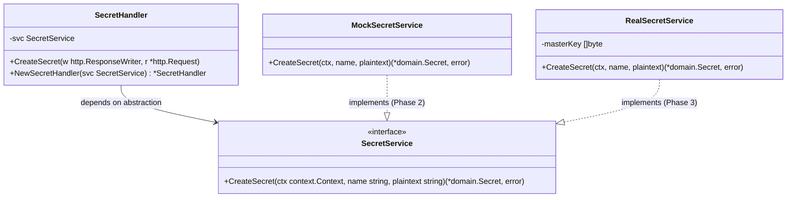
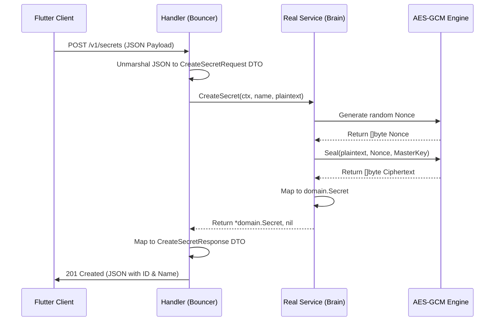

# Current State: Class Diagram (Clean Architecture)

This shows how your layers interact and how the Mock vs. Real service will plug into the interface.

## Upcoming State: Sequence Diagram (The Cryptographic Flow)

This maps out the exact data flow we are about to implement in Phase 3.

