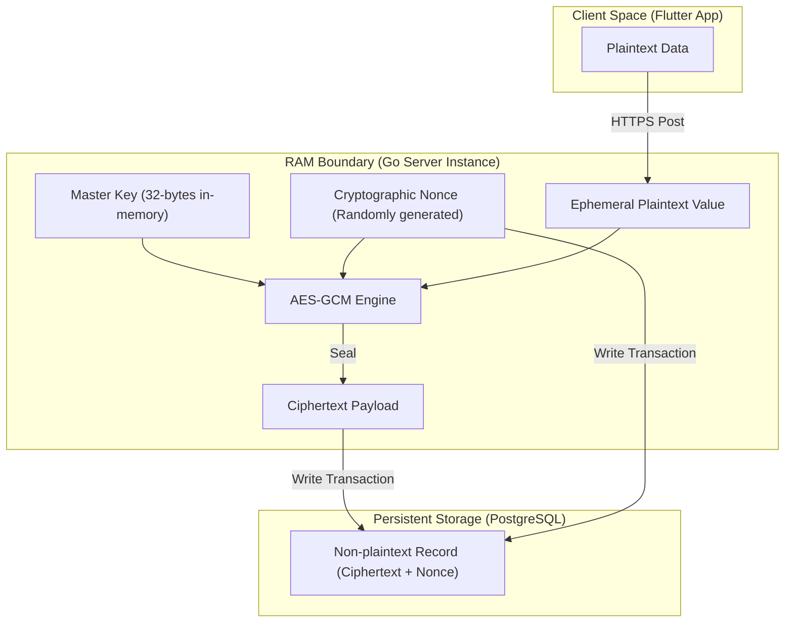
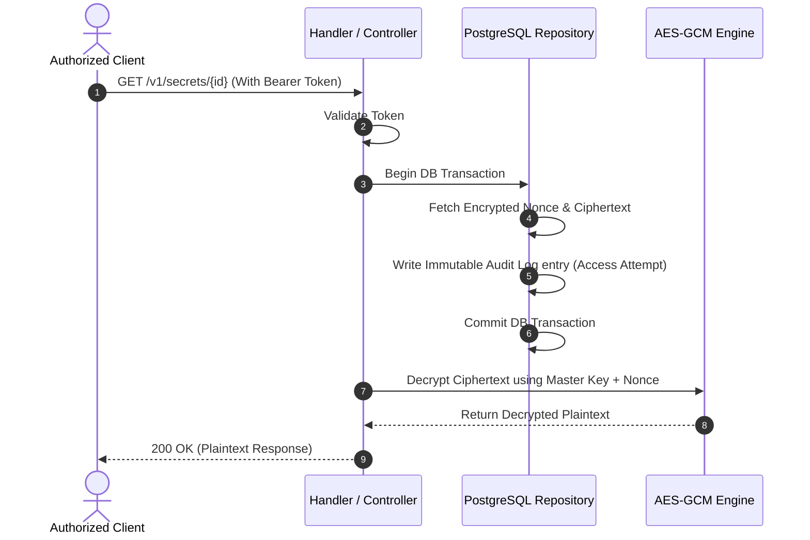

# System Design and Security Architecture

This document describes the design patterns, security boundaries, and data flows of **The Vault**.

## 🏗️ Architectural Overview

The Vault is designed around a **Clean Architecture** style, separating pure business logic from external frameworks, databases, and network transports.



---

## 🔒 Security Guarantees & Memory Management

### Ephemeral Memory Handling

To prevent plaintext secrets from persisting in Go's managed memory (which is controlled by the Garbage Collector and may not be freed immediately), the system uses the following safeguards:

1. **Byte Arrays over Strings:** Plaintext values are stored in byte slices (`[]byte`) instead of Go `string` objects. Go strings are immutable and cannot be zeroed out in-place.
2. **Explicit Zeroing (Scrubbing):** Once the encryption/decryption process completes, the plaintext byte slices are explicitly overwritten with zeroes:

   ```go
   for i := range plaintextBytes {
       plaintextBytes[i] = 0
   }
   ```

---

## 🔄 Secret Retrieval Flow

Every secret read operation is strictly audited. An access token must be provided, and a log entry is written atomically before returning the plaintext.


