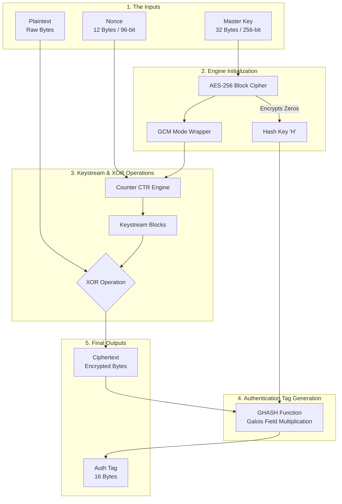

# AES-GCM Encryption Flow

```mermaid
graph TD
    %% Inputs
    subgraph Inputs [1. The Inputs]
        Key[Master Key <br> 32 Bytes / 256-bit]
        Nonce[Nonce <br> 12 Bytes / 96-bit]
        Plaintext[Plaintext <br> Raw Bytes]
    end

    %% Engine Initialization
    subgraph Engine [2. Engine Initialization]
        AES[AES-256 Block Cipher]
        GCM[GCM Mode Wrapper]
        HKey[Hash Key 'H']
    end

    %% Core Processing
    subgraph Processing [3. Keystream & XOR Operations]
        Counter[Counter CTR Engine]
        Keystream[Keystream Blocks]
        XOR{XOR Operation}
    end

    %% Tag Generation
    subgraph Auth [4. Authentication Tag Generation]
        GHASH[GHASH Function <br> Galois Field Multiplication]
    end

    %% Outputs
    subgraph Outputs [5. Final Outputs]
        Ciphertext[Ciphertext <br> Encrypted Bytes]
        Tag[Auth Tag <br> 16 Bytes]
    end

    %% Connections
    Key --> AES
    AES --> GCM
    AES -->|Encrypts Zeros| HKey
    
    Nonce --> Counter
    GCM --> Counter
    Counter --> Keystream
    
    Plaintext --> XOR
    Keystream --> XOR
    XOR --> Ciphertext
    
    Ciphertext --> GHASH
    HKey --> GHASH
    GHASH --> Tag
    
    class Key,Nonce,Plaintext input;
    class AES,GCM,HKey engine;
    class Counter,Keystream,XOR,GHASH process;
    class Ciphertext,Tag output;
```
